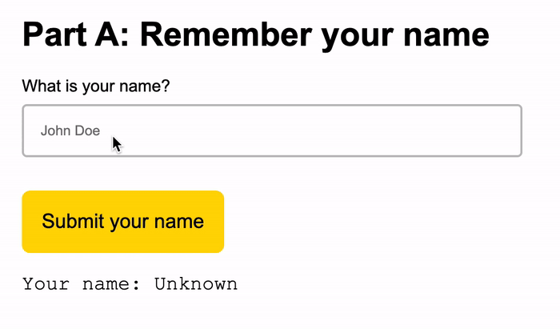

# 01 Exercise - JavaScript Scope and Closures

## Brief

Create a program that remembers your name. Enter your name in the form text input, and click `Submit your name`. It should display the name you typed into the form. If you resubmit the form with a different name, it should remember the first name you typed. 



## Rationale

Scope and closures are fundamental to how JavaScript works. They ensure your web applications can remember values even when a function re-runs multiple times.

## Code-along videos

Attempt this exercise yourself first. If you get stuck, there is a code along video inluded at the bottom of the instructions which you can use as a reference.

### Getting started

1. Open `Submission/script.js` in VS Code and `index.html` in your web browser with Live Server
   - **Note:** there is another JavaScript file `lib/index.js`, you can ignore this file. It exists to make sure the form works.
2. Find the correct place to write your code by reading the code comments. 
3. Declare a function named: `getName`, and ensure it takes a single parameter: `name`
4. The function should `return` the correct values to pass all the test scenarios below.

## Test scenarios that need to pass

1. Input: `John Lennon`
2. Output: `John Lennon`

---

1. Input: `John Lennon`
2. Output: `John Lennon`
3. Input again: `George Harrison`
4. Output: `John Lennon`

---

1. Input: `Paul McCartney`
2. Output: `Paul McCartney`
3. Input again: `John Lennon`
4. Output: `Paul McCartney`

## Automated tests

<details>
  <summary>Running automated tests on your computer</summary>
  <br>

This exercise contains tests that check your code is correct. If you want to run the tests yourself, you can type the following into your terminal:

Use the following command **once**. This will install all the required dependencies to run the tests:

```shell
npm install
```

You can run tests that check you have met the test scenarios. You can then run the test command as many times as you like. 

```shell
npm test
```

</details>

# Submit your Exercise

- [ ] Commits are pushed to GitHub
- [ ] Automated tests are passing in GitHub

---

## Exercise answer walkthrough

- [Solving the JavaScript remembering your name exercise](https://www.loom.com/share/b252972334334b258dd632e9abb65828)